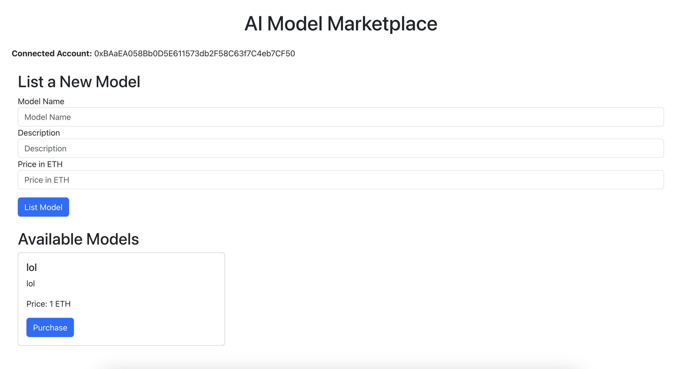

# Blockchain Midterm Project

## Getting Started

Follow the steps below to set up and run the project:

1. **Launch Ganache**
   - Start your local blockchain by launching Ganache.

2. **Link Truffle to Ganache**
   - Ensure Truffle is properly connected to your Ganache instance.

3. **Compile and Deploy Contracts**
   - Use Truffle to compile and deploy the contracts.
   - **Important**: Before deploying, make sure you have updated the `"from"` variable in the configuration settings.

4. **Run the React App**
   - After successfully deploying the contracts, you can start the React application.
   - **Note**: Ensure the `abi.js` file is updated with the correct ABI and contract address before starting the app.

## Examples

## Avaible 

## Detail 

## Ganache 

## Rate

